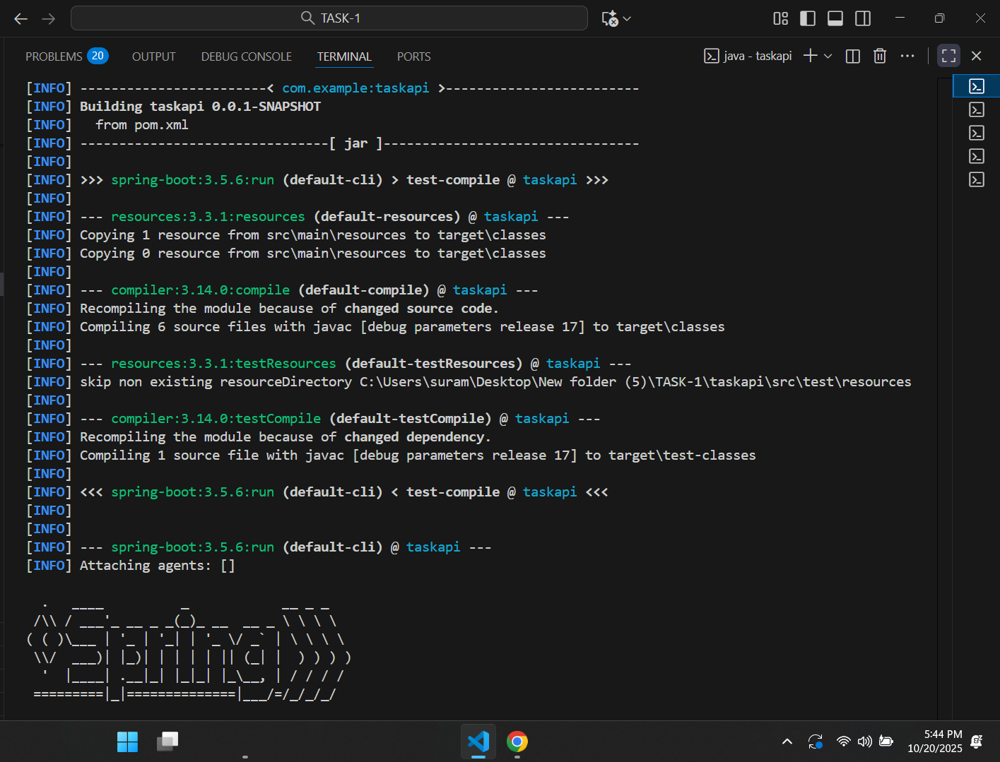
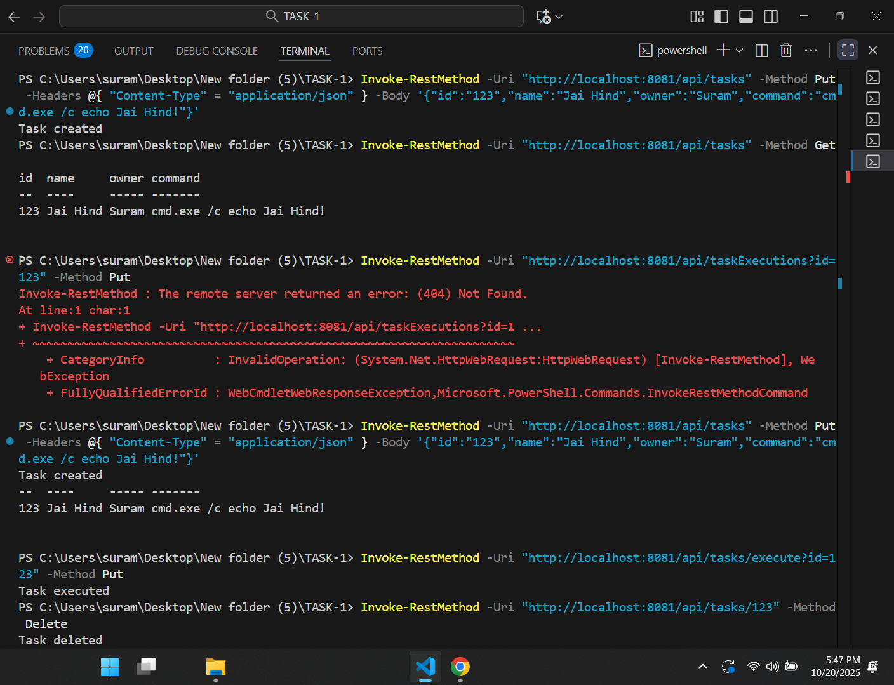
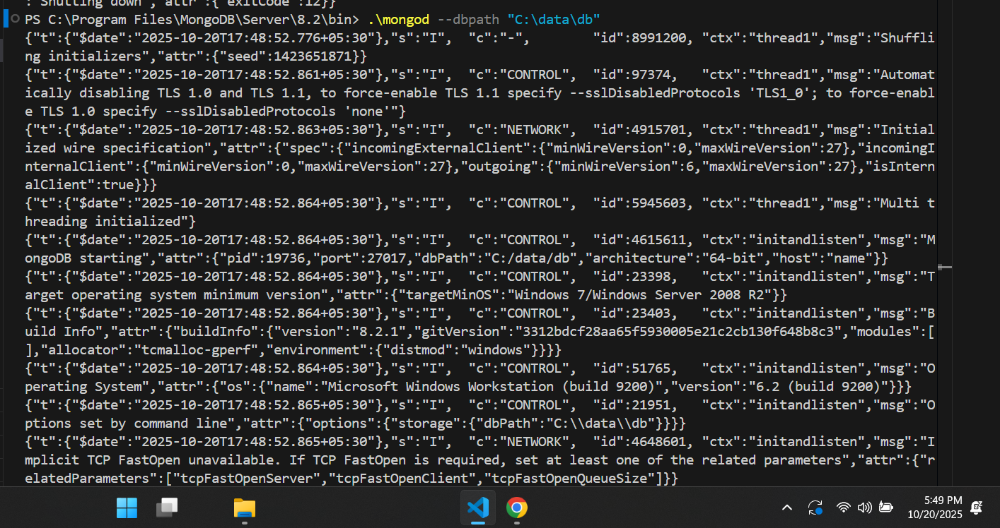

# Kaiburr Task 1: Task Management REST API

## Overview
This repository contains the implementation of Task 1 for the Kaiburr Assessment. It is a Java-based REST API built with Spring Boot, integrated with MongoDB for task storage. The API supports task creation, retrieval, execution (local command execution), and deletion, with input validation for task fields.

## How to Compile, Run, and Deploy
- **Prerequisites**:
  - JDK 17 or later
  - Maven 3.6 or later
  - MongoDB (running on localhost:27017)
- **Steps**:
  1. Navigate to the project directory:cd C:\Users\suram\Desktop\New folder (5)\TASK-3\taskapi6
  2. Compile the project:mvn clean install
  3. Start MongoDB:
- Open a terminal and run:mongod
  4.Run the application:mvn spring-boot:run
- **Access**: API endpoints are available at `http://localhost:8080/api/tasks` once the application is running.

## Database Setup
- **Database Name**: `taskdb`
- **Collection**: `tasks`
- **Schema**:
- `id`: String (unique identifier, e.g., "123")
- `name`: String (task name, e.g., "Jai Hind")
- `owner`: String (task owner, e.g., "Suram")
- `command`: String (execution command, e.g., "cmd.exe /c echo Jai Hind!")
- **Initial Setup**:
- The collection is created dynamically when tasks are added via the API.

## API Endpoints
- **Get All Tasks**
- URL: `GET /api/tasks`
- Response: JSON array of tasks
- Example: `[{"id": "123", "name": "Jai Hind", "owner": "Suram", "command": "cmd.exe /c echo Jai Hind!"}]`
- **Create Task**
- URL: `PUT /api/tasks`
- Request Body: JSON object with `id`, `name`, `owner`, `command`
- Example: `{"id": "123", "name": "Jai Hind", "owner": "Suram", "command": "cmd.exe /c echo Jai Hind!"}`
- Response: Success message or validation error
- **Execute Task**
- URL: `PUT /api/taskExecutions?id={id}`
- Response: Success message or error (executes the command locally)
- **Delete Task**
- URL: `DELETE /api/tasks/{id}`
- Response: Success message or error

## How to Use
- Ensure MongoDB is running before starting the application.
- Test the API endpoints using tools like Postman or curl:
- **Create Task**:
- curl -X PUT -H "Content-Type: application/json" -d "{"id":"123","name":"Jai Hind","owner":"Suram","command":"cmd.exe /c echo Jai Hind!"}" http://localhost:8080/api/tasks
- - **Get Tasks**:curl -X GET http://localhost:8080/api/tasks
  - **Execute Task**:curl -X PUT http://localhost:8080/api/taskExecutions?id=123
  - **Delete Task**:curl -X DELETE http://localhost:8080/api/tasks/123
  - - Verify task data in MongoDB with `db.tasks.find()` in the MongoDB shell.

## Verification
- **Compilation**: Confirm `mvn clean install` completes without errors (see screenshot below).
- **Running**: Verify `mvn spring-boot:run` starts the app successfully (see screenshot below).
- **MongoDB**: Check database connection with `db.tasks.find()` (see screenshot below).
- **API Testing**: Test endpoints with curl or Postman and confirm responses.
- **Screenshots**: Included below with timestamp (03:48 PM IST, Oct 20, 2025) and username (Suram).

## Screenshots
- **Compilation**:

- **Application Running**:

- **MongoDB Connection**:

## Notes
- This implementation follows the Kaiburr Assessment requirements for Task 1, including input validation and local command execution.
- No zip, Doc, or PDF files are included in the repository.
- The project structure is maintained with `pom.xml` and `src/` directories.
